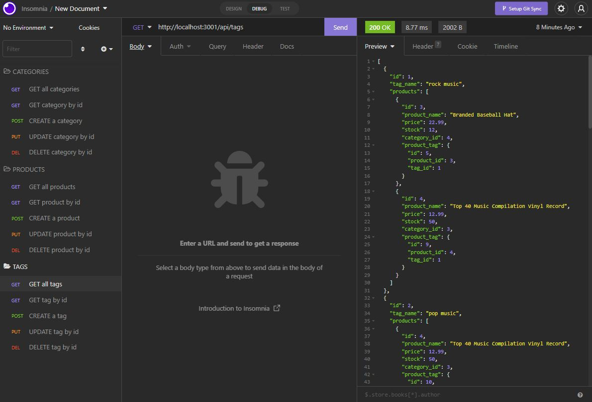
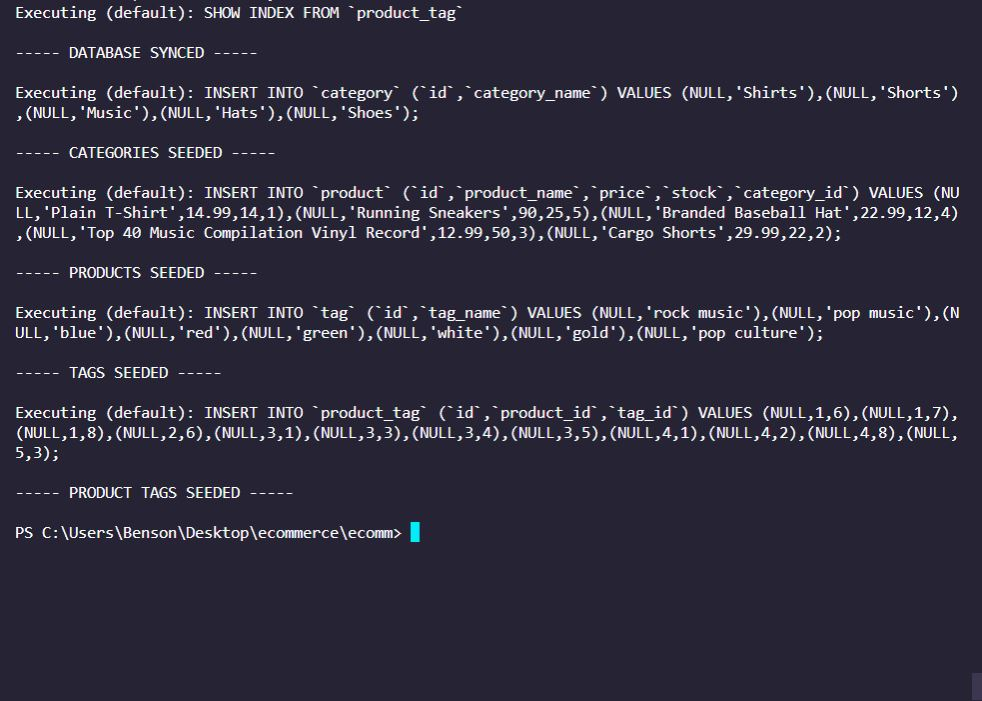
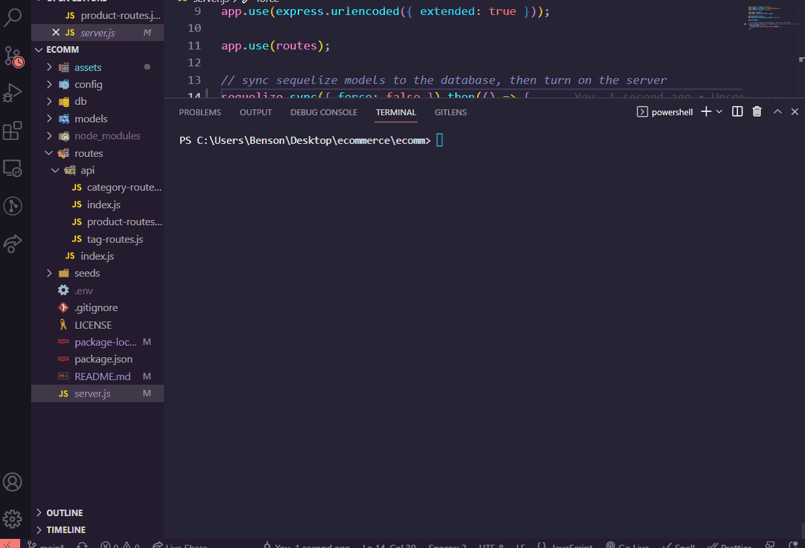

# E-Commerce Back End




<br>

## Table of Contents

- [Description](#description)
- [Installation](#installation)
- [Usage](#usage)
- [Demo](#demo)
- [Technologies Used](#technologies-used)
- [Questions](#questions)
- [License](#license)

<br>

## Description

Back-end application for an e-commerce website. The Object Relational Mapping tool [sequelize](https://sequelize.org/) is used to run a [MySQL](https://www.mysql.com/) database using JavaScript via Node.js.
<br>

## Installation

[Node.js](https://nodejs.org/en/) installation is required. Clone repo and follow usage commands.

<br>

## Usage

<br>

This application can be used by entering the following commands-

<br>

Install dependencies:

```
npm install
```

Seed the database with sample information:

```
npm run seed
```

<br>


Start the application:

```
node server
```

<br>

## Demo

<br>

<!-- [Full Video Demo](https://drive.google.com/file/d/1yIqOX--lV8A__oeqv3z-9nNMT06sUJdY/view) -->

<br>
Demo gif:



<br>

## Technologies Used

- [Node.js](https://nodejs.org/en/)
- [mysql2](https://www.npmjs.com/package/mysql2)
- [express](https://expressjs.com/)
- [sequelize](https://sequelize.org/)
- [dotenv](https://www.npmjs.com/package/dotenv)
- [insomnia](https://insomnia.rest/)

<br>

## Questions

Contact me here:

- [GitHub Profile](https://github.com/mbenson025)
- Email me at mbenson025@gmail.com

<br>

## License

MIT License

Copyright (c) 2022 Mason Benson

Licensed under the [MIT](LICENSE) license.
